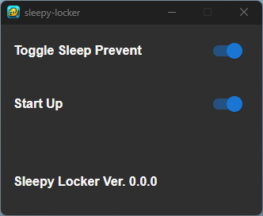

# Sleepy Locker 🔒💤

Sleepy Lockerは画面が勝手にスリープしないようにするためのWindowsユーティリティアプリの一つです!

普通のスリープ防止アプリとは異なる点は、**PCロック中は画面スリープしてくれる**点です。探した限りではこのようなアプリケーションはなかったため作成しました!

- Toggle Sleep Prevent: スリープ防止の切り替えをします。
- Start Up: PC起動時に本アプリを起動するかを設定します。

リリースページ: https://github.com/anotherhollow1125/sleepy-locker/releases

ダウンロード: https://github.com/anotherhollow1125/sleepy-locker/releases/download/app-v0.0.2/sleepy-locker_0.0.2_x64_ja-JP.msi

自分用に作ったのですごく簡素で配慮のないUIになっています、ｺﾞﾒﾝﾅｻｲ😣

もっと良い案や改善するべき点があればissueをいただけると幸いです🙏